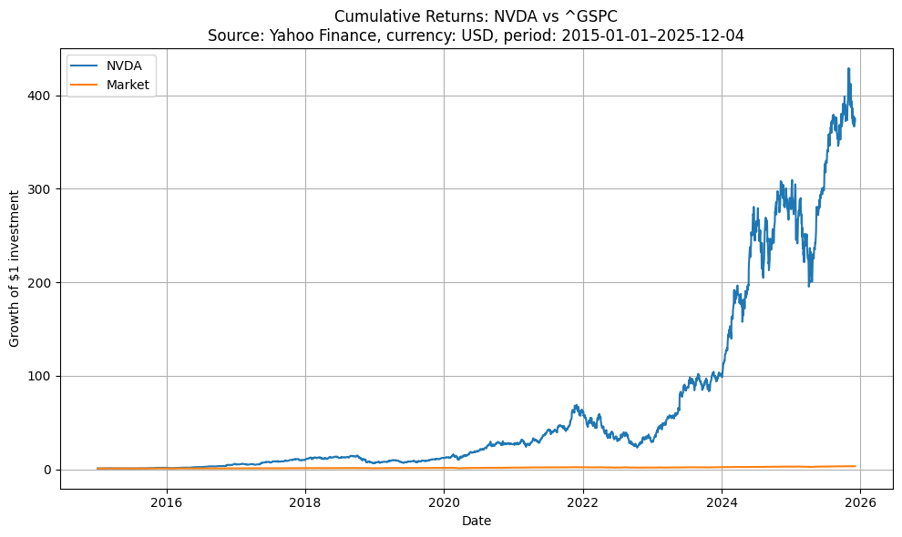
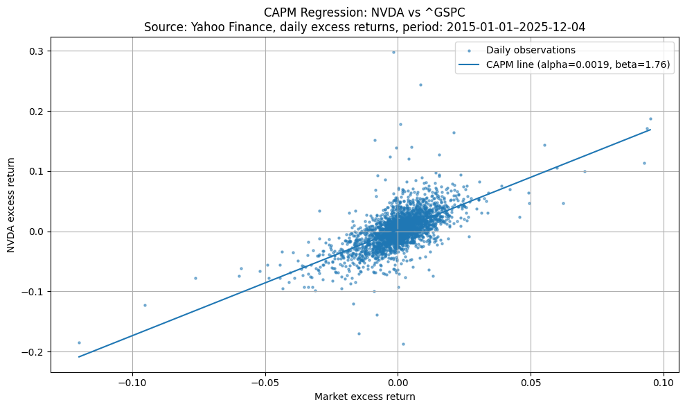
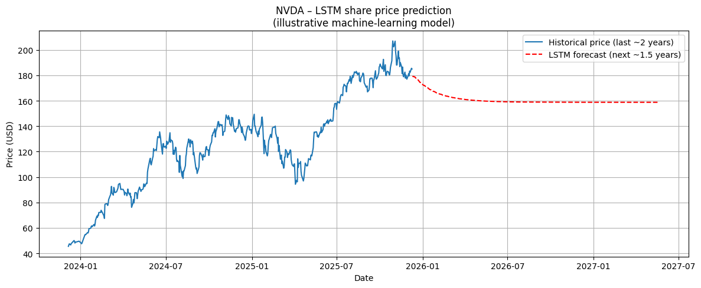

# Automated Equity Analysis — NVIDIA (NVDA)


An end-to-end equity analysis of **NVIDIA Corporation (NVDA)** that brings
fundamental valuation, technical indicators, a CAPM regression, and an
illustrative LSTM machine-learning forecast into a single reproducible Python
workflow. The accompanying written report turns the output into a structured
investment recommendation.



*Growth of a $1 investment in NVDA versus the S&P 500 (2015–2025). NVDA
dramatically outperforms the index over the period.*

---

## Overview

The project answers a single question from a fund manager's perspective:
**is NVDA an attractive long-term holding, and at what risk?** It does so by
combining four complementary lenses, each implemented in Python and pulling
live data from Yahoo Finance:

1. **Fundamental analysis** — profitability (net margin, ROA, ROE), growth,
   capital structure and solvency, liquidity, and valuation multiples,
   benchmarked against peers AMD and AVGO.
2. **Technical analysis** — 50- and 200-day moving averages, Bollinger Bands,
   and the 14-day Relative Strength Index (RSI).
3. **CAPM regression** — an OLS regression of NVDA's daily excess returns on
   S&P 500 excess returns to estimate alpha (excess return) and beta
   (systematic risk).
4. **Machine-learning forecast** — a two-layer LSTM neural network trained on
   historical daily prices to produce an illustrative forward price path.

## Selected results

| Metric | Value | Interpretation |
|---|---|---|
| Beta (vs S&P 500) | **≈ 1.76** | ~76% more volatile than the market |
| Alpha (daily) | **≈ +0.0019** | Small positive excess return |
| R² of CAPM fit | **≈ 0.418** | Market explains ~42% of daily variation |
| p-value (beta) | **< 0.001** | Beta is highly statistically significant |
| Trailing net margin | **> 50%** | Exceptional profitability for the sector |
| Recommendation | **Long-term Buy** | For growth-oriented, high-risk-tolerance clients, with staged entry |

<p align="center">
  
  
</p>

*Left: CAPM regression of NVDA excess returns on the S&P 500 (β ≈ 1.76).
Right: illustrative LSTM forward price path. The forecast is for demonstration
only — it converges toward a flat path and is not a price target.*

## Repository structure

```
automatically-equity-analysis-NVDA/
├── nvda_equity_analysis.py     # full analysis pipeline (13 labelled sections)
├── requirements.txt            # core dependencies (always required)
├── requirements-optional.txt   # TensorFlow/scikit-learn (only for the LSTM section)
├── report/
│   └── Investment_Analysis_NVDA.pdf   # full written report with figures & references
├── figures/                    # all charts produced by the script (PNG)
├── README.md
└── LICENSE
```

## How to run

```bash
# 1. clone the repository
git clone https://github.com/yaroslavdeineka/automatically-equity-analysis-NVDA.git
cd automatically-equity-analysis-NVDA

# 2. (optional) create a virtual environment
python -m venv venv
source venv/bin/activate          # Windows: venv\Scripts\activate

# 3. install the core dependencies
pip install -r requirements.txt

# 4. run the analysis
python nvda_equity_analysis.py
```

The script downloads data live, prints the CAPM regression summary, and opens
each chart in turn. Because prices are pulled in real time, re-running it
returns up-to-date numbers; the figures saved in `figures/` and embedded in the
PDF report reflect the snapshot used at the time of writing.

### Optional: machine-learning forecast (Section 13)

Section 13 (the LSTM price forecast) needs TensorFlow and scikit-learn, which
currently only support Python 3.10–3.13 (not 3.14+). It's kept in a separate
requirements file so installing the core analysis never fails because of it:

```bash
pip install -r requirements-optional.txt
```

If TensorFlow isn't installed, or your Python version isn't supported, the
script automatically skips Section 13 with a short message — everything else
still runs.

## Data sources

- **Yahoo Finance** (via the `yfinance` library) — prices, returns, and
  financial statements for NVDA, AMD, AVGO, and the S&P 500 (`^GSPC`).
- Supplementary context (segment revenue, macro figures) referenced in the
  written report from Macrotrends, Bloomberg, and company filings — see the
  References section of the PDF.

## Tech stack & skills demonstrated

- **Python data stack:** `pandas`, `numpy`
- **Econometrics:** `statsmodels` (OLS / CAPM)
- **Machine learning:** `tensorflow` / `keras` (LSTM), `scikit-learn` (scaling)
- **Visualisation:** `matplotlib`
- **Applied finance:** fundamental ratio analysis, technical indicators,
  CAPM, peer benchmarking, and turning quantitative output into a written
  investment thesis.

## Disclaimer

This project was produced for **educational and portfolio purposes only**. It
does not constitute investment advice, a recommendation, or an offer to buy or
sell any security. The machine-learning forecast is illustrative and should not
be interpreted as a price prediction. Always do your own research.

## Author

**Yaroslav Deineka** — MSc International Business with Business Analytics
[LinkedIn](https://www.linkedin.com/in/yaroslav-deineka-b91622323) ·
[GitHub](https://github.com/yaroslavdeineka)
